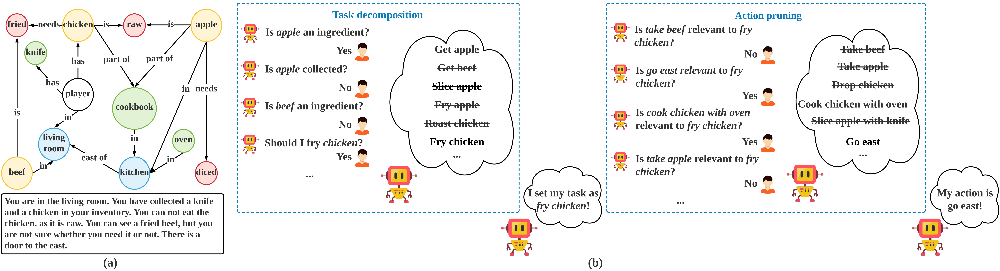
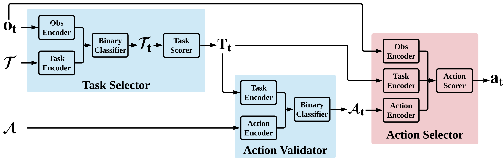

# QWA

Code for paper [Perceiving the World: Question-guided Reinforcement Learning for Text-based Games]()

Yunqiu Xu, Meng Fang, Ling Chen, Yali Du, Joey Tianyi Zhou and Chengqi Zhang

-----

+ An overview of the decision making process:




+ Model architecture:




-----
## Installation

+ Our code depends heavily on [xingdi-eric-yuan/GATA-public](https://github.com/xingdi-eric-yuan/GATA-public). The additional dependencies could be found at [requirements.txt](requirements.txt)


+ Download the word embeddings:

```
wget "https://bit.ly/2U3Mde2"
```

+ Datasets for pre-training the task selector and the action validator are provided at [this link](), other datasets could be downloaded at:

```
# AP
wget https://aka.ms/twkg/ap.0.2.zip

# RL
wget https://aka.ms/twkg/rl.0.2.zip
```

-----
## Training

+ Modify the paths within the config files, e.g. "word_embedding_path"

+ Action prediction (providing initialization for the encoders):

```
python train_ap.py config/config_pretrainAL.yaml
```

+ Task selector (pre-training phase):

```
python train_vt.py config/config_pretrainVT.yaml
```

+ Action validator (pre-training phase):

```
python train_va.py config/config_pretrainVA.yaml
```

+ Action selector (reinforcement learning phase):

```
# Medium games
python train_rl_medium.py config/config_trainRL_medium.yaml

# Hard games
python train_rl_hard.py config/config_trainRL_hard.yaml
```

-----
## Citation

```
Add bib
```

-----
## License

[MIT License](LICENSE)


